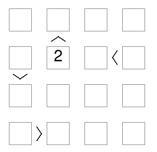
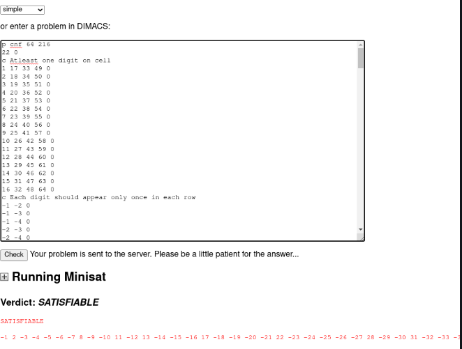
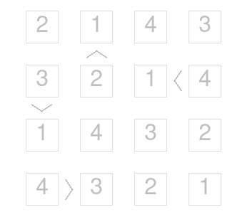
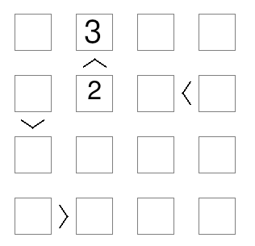

# Futoshiki  

Futoshiki is NxN board game where the player has to discover the digits hidden inside each cell. for more information [https://www.futoshiki.org/](https://www.futoshiki.org/)

## Workings
This code generates Dimacs-CNF (Conjuctive Normal Form) for the state of the board that can be solved by SAT solver such as [http://logicrunch.it.uu.se:4096/~wv/minisat/](http://logicrunch.it.uu.se:4096/~wv/minisat/).   

## Description

For the futoshiki board of size $N \times N$
Let us suppose $P(i,j,n)$ represents a cell on $i^{th} \ row\ and \ j^{th} column$  and $N$ is the digit to be placed on the range $0..N$  
The objective of Futoshiki board game is to fill its $N \times N$ grid with numbers 
- Let the assigned state at the start be
$$
P(i,j,n) 
$$
where i and j are row and column number and n is the assigned number

- To ensure one number $0..N$ in a cell in row $i$ and column $j$
$$
\bigwedge\limits_{i=1}^{N}\bigwedge\limits_{j=1}^{N}\bigvee\limits_{n}^{N} P(i,j,n)
$$

- To ensure a number should appear at most once in each row
$$
\bigwedge\limits_{i=1}^{N}\bigwedge\limits_{n}^{N}\bigwedge\limits_{j=1}^{N-1}\bigwedge\limits_{k=j+1}^{N}  (\lnot P(i,j,n) \lor \lnot P(i,k,n))
$$
- To Ensure that number appears at most once in each column
 $$
\bigwedge\limits_{j=1}^{N}\bigwedge\limits_{n}^{N}\bigwedge\limits_{i=1}^{N-1}\bigwedge\limits_{k=i+1}^{N}  (\lnot P(i,j,n) \lor \lnot P(k,j,n))
$$

- For inequality constraints

$$
\bigwedge\limits_{N-1}^{n}\bigwedge\limits_{k=i+1}^{N} (\lnot P(i_l,j_l,n) \lor \lnot P(i_g,j_g,k))
$$

$$
i_l = row\ of\ cell\ that\ /![is\  lower \\
j_l = column\ of\ cell\ that\ is\ lower\\ 
i_g = row\ of\ cell\ that\ is\ greater\\
j_g = column\ of\ cell\ that\ is\ greater\\
$$


The Solution has been written in rust while keeping the above constraints in mind


#####  design of developed DIMACS-CNF Format generator
To develop **DIMACS-CNF** generator, we should know what **CNF** means. CNF(Conjuctive Normal form ) is conjuction of one or more clause where a clause is disjunction of literals. It is a *product of sums*.  **DIMACS-CNF** is a format that represents a formula in conjuctive normal form. 
for the syntax of DIMACS-CNF , the header always starts with
`p cnf <variables> <clauses>` . here `variables` and `clauses` are represented with decimal numbers. then the clauses will be written line by line and to seperate clause `0` is appended at the end. 

for example :  $(x \lor y \lor z) \land (\lnot y \land z)$ can be written as 
```cnf
c comments start with c

c header
p cnf 3 2

c 1 2 -3 can be thought as (x or y or not z)
1 2 -3 0 
-2 3 0
```

For the futoshiki board, let us suppose we have $4 \times 4$ grid. This gives us four row position, four column position and four numbers. We have $64\ variables$. so we have to convert row position , column position and digit itself into a range of $0..64$.  The formula we have used is 
$$
N \times N \times (digit-1) + N \times (row - 1) + (column - 1) + 1) 
$$

Digit, Column and Rows are in range of $0..N$. For example in $4 \times 4$ board,  if our row is $3$ and column is $4$ and our digit is $1$ then it is represented as $16$.
$$
4 \times 4 \times (1-1) + 4 \times (3 - 1) + (4 - 1) + 1) =  16
$$

### two concrete examples of a Futoshiki board, one satisfiable and one unsatisfiable, their translation into DIMACS-CNF format and the generated solutions by the SAT solver.

 For **Satisfiable** part , let us suppose $4\times4$ board. 


##### Representation of the board
With Respect to the **Rust code** this can be represented as 
```rust
// add 2 on 2nd row and 2nd column
self.cnf.push(format!("{} 0", self.to_variable(2, 2, 2)));

// There are 4 constraints where 
// (1,2) < (2,2)
// (3,1) < (2,1)
// (4,2) < (4,1)
// (2,3) < (2,4)

// They are represented in code as 
 Constraint {   less_than_pointing_cell_in_row: 2,
                less_than_pointing_cell_in_col: 2,
                greater_than_pointing_cell_in_row: 1,
                greater_than_pointing_cell_in_col: 2,
            },
           .....
```
##### Translatoin into DIMACS-CNF
Once `generate()` function is called , then at first digits are assigned to each cell with `pre_assigned_values()`. After that there is conjuction of clauses that ensure each digit is included only once in a row with `each_digit_only_once_in_row()`. Same thing has to be done for the clauses with `each_digit_only_once_in_column()` and at last inequality constraints clauses are also conjucted with `add_constraints()`
The file `test.cnf` will be something like
```cnf
p cnf 64 216
22 0
c Atleast one digit on cell
1 17 33 49 0
2 18 34 50 0
..
c Each digit should appear only once in each row
-1 -2 0
-1 -3 0
..
c each digit should appear only once in column
-1 -5 0
-1 -9 0
-1 -13 0
...
c Adding Constraints
-6 -18 0
-6 -34 0
...
```

#### Verification
To verify whether the generated CNF file was satisfiable or not , i used [http://logicrunch.it.uu.se:4096/~wv/minisat/](http://logicrunch.it.uu.se:4096/~wv/minisat/) solver developed by  Niklas Eén and Niklas Sörensson. 

The solution presented is
```
SATISFIABLE

-1 2 -3 -4 -5 -6 -7 8 -9 -10 11 -12 13 -14 -15 -16 17 -18 -19 -20 -21 22 -23 -24 -25 -26 -27 28 -29 -30 31 -32 -33 -34 35 -36 37 -38 -39 -40 -41 42 -43 -44 -45 -46 -47 48 -49 -50 -51 52 -53 -54 55 -56 57 -58 -59 -60 -61 62 -63 -64 0
```

Here is one of the possible solution for the board above.


#### For **Unsatisfiable part** Here is one of the possible state

This can't be solved because $2 < 3$ and for this board state to be satisfiable 2 must be greater than 3 which can never be the case. The only condition that needs to be added to satisfiable part's code is a new pre assigned value 3 on 1st row of 2nd column
```
 let facts = 2; //change number of facts to 2
 self.cnf.push(format!("{} 0", self.to_variable(2, 2, 2)));
         unsatisfiable condition
 self.cnf.push(format!("{} 0", self.to_variable(3, 1, 2)));
```


